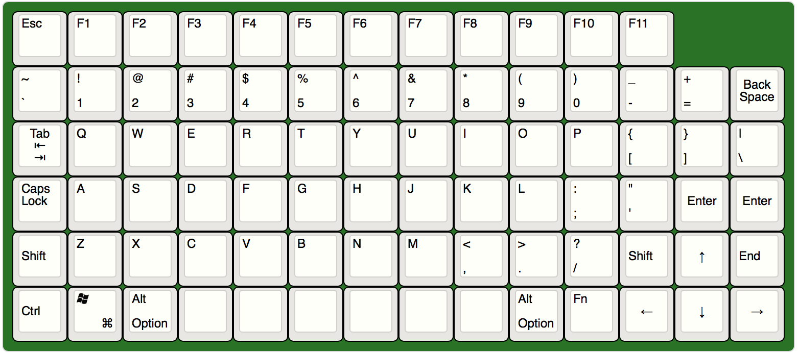
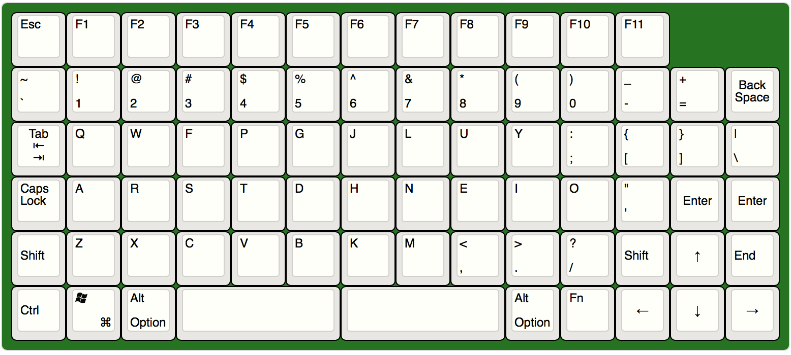

# Quantum Mechanical Keyboard Firmware

This firmware is for a DIY 6 x 14 (- 2) PCB using Kailh Low Profile switches.
More info [here](https://imgur.com/a/gqjEYFf).

## Parts List

- [Kailh Low Profile Switches](https://novelkeys.xyz/products/kailh-low-profile-switches) (82)
- [1N4148 Diodes](https://en.wikipedia.org/wiki/1N4148_signal_diode) (82)
- [Teensy 2.0](https://www.pjrc.com/store/teensy.html) (1) 

## Supported layouts

### Grid

### Plum

----

## QMK Documentation

* [See the official documentation on docs.qmk.fm](https://docs.qmk.fm)

The docs are hosted on [Gitbook](https://www.gitbook.com/book/qmk/firmware/details) and [GitHub](/docs/) (they are synced). You can request changes by making a fork and [pull request](https://github.com/qmk/qmk_firmware/pulls), or by clicking the "suggest an edit" link on any page of the docs.

## Official website

[http://qmk.fm](http://qmk.fm) is the official website of QMK, where you can find links to this page, the documentation, and the keyboards supported by QMK.
